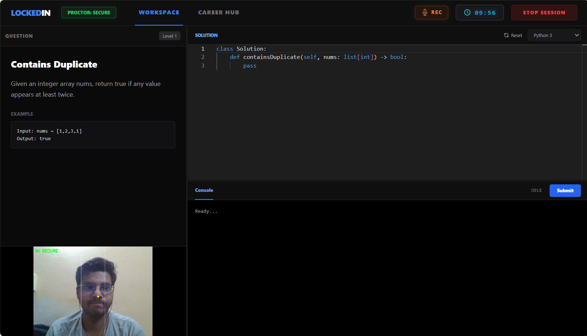
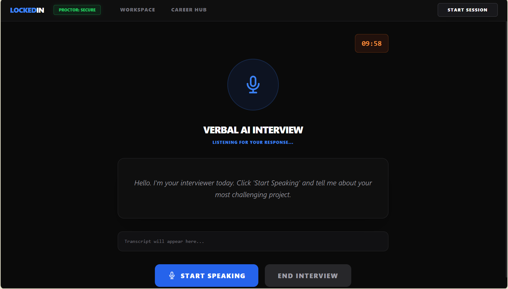
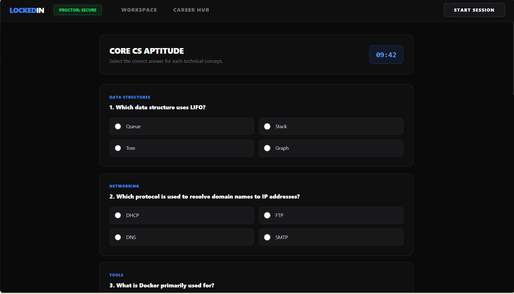
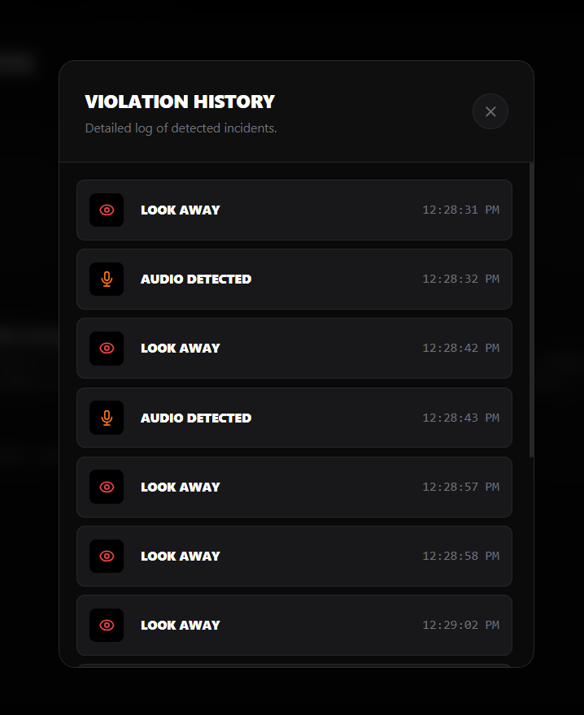
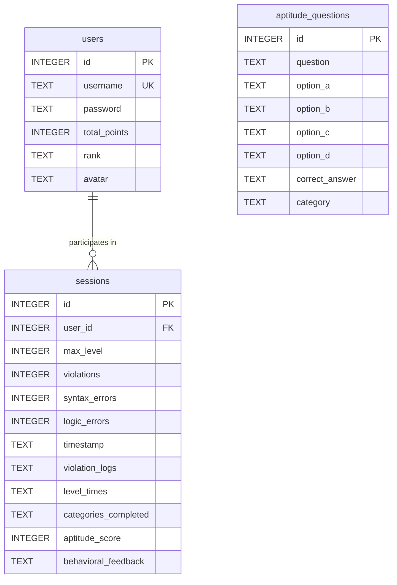

<div align="center">

# 🔒 LockedIn AI

### **AI-Powered Adaptive Proctoring & Technical Interview Preparation Platform**

*Simulate real-world technical interviews, practice coding in an isolated sandbox under multimodal AI proctoring, and sharpen CS fundamentals with actionable analytics.*

[](https://python.org)
[](https://flask.palletsprojects.com/)
[](https://ai.google.dev/)
[](https://ollama.ai/)
[](https://developers.google.com/mediapipe)
[](https://opencv.org/)
[](https://microsoft.github.io/monaco-editor/)
[](https://tailwindcss.com/)
[](https://sqlite.org/)

---

[Key Features](#-key-features) •
[System Architecture](#-system-architecture) •
[Screenshots](#-screenshots--ui-showcase) •
[Tech Stack](#-tech-stack) •
[Database Schema](#-database-relational-schema) •
[Installation & Setup](#-getting-started) •
[API Reference](#-api-endpoints) •
[Security & Proctoring](#-anti-cheat--proctoring-mechanisms)

---

</div>

## 📌 Overview

**LockedIn AI** is a comprehensive educational and assessment platform engineered to prepare candidates for high-stakes technical coding rounds and developer interviews. 

Unlike standard coding platforms that only verify test cases or intrusive proctoring tools that stream private video feeds to third parties, **LockedIn AI** delivers:
- **Local, privacy-first AI proctoring** using MediaPipe Face Mesh & PyAudio RMS energy detection running on the candidate's machine.
- **Dynamic voice-interactive technical mock interviewer** powered by Google Gemini API with local Ollama fallback.
- **Multi-language isolated code execution sandbox** (Python, Java, JavaScript) with real-time test case evaluation and adaptive difficulty scaling.
- **Computer Science Aptitude assessments** and deep **6-axis analytical skill profiling** (Radar & Time-series performance charts).

---

## 🚀 Key Features

### 1. 💻 Multi-Language Code Workspace & Isolated Sandbox
* **Monaco Editor Integration**: Embedded VS Code core editor featuring full syntax highlighting, automatic indentation, error linting, and smart auto-completion.
* **Multi-Language Support**: Seamless execution of **Python 3**, **Java**, and **JavaScript (Node.js)**.
* **Isolated Temporary Sandbox**: Code runs in isolated temporary workspaces (`tempfile.TemporaryDirectory`) executed via safe subprocesses with `shell=False`.
* **Resource Constraints & Safety**: Strict $5.0\text{s}$ execution timeouts prevent infinite loops, fork bombs, and command injection attacks.
* **Adaptive Difficulty (Levels 1 to 5)**: Real-time dynamic difficulty scaling that unlocks progressively harder challenges as test cases pass.

### 2. 🛡️ Real-Time Multimodal AI Proctoring
* **Computer Vision Eye & Gaze Tracking**: MediaPipe Face Mesh tracks 468+ facial landmarks locally, calculating head orientation and normalized iris-to-eye-corner gaze vectors ($[0.35, 0.65]$ threshold). Flags lateral gaze deviations and looking away.
* **Ambient Audio Energy Monitoring**: Background PyAudio thread samples microphone input, calculating Root Mean Square (RMS) audio energy to flag background whisperers, secondary speakers, or unauthorized coaching.
* **Keystroke & Paste Dynamics**: Monitors typing velocity and flags abnormal paste bursts ($>50$ characters in $<10\text{ms}$).
* **Tab & Window Visibility Tracking**: Utilizes the browser's Page Visibility API to immediately log tab switches, window minimization, and external app usage.

### 3. 🎙️ Interactive AI Behavioral & Technical Mock Interviewer
* **Professional Interviewer Persona**: Simulates rigorous technical interview panels without generic cheerleader responses.
* **Dual LLM Architecture**:
  * **Primary**: Google Gemini 2.5 Flash / 1.5 Flash for ultra-fast, context-rich technical evaluations.
  * **Offline Fallback**: Local Ollama instance (supporting `llama3.2:1b`, `qwen`, `gemma4:e2b`, etc.) automatically spun up if offline or without an API key.
* **Natural Voice Interaction**:
  * **Speech-to-Text (STT)**: Web Speech API for low-latency candidate voice transcription.
  * **Text-to-Speech (TTS)**: Microsoft Edge-TTS streaming with offline fallback via `pyttsx3`.

### 4. 🧠 Computer Science Aptitude Assessment
* Comprehensive MCQ test engine covering foundational CS subjects: **Operating Systems**, **Database Management Systems (DBMS)**, **Data Structures & Algorithms (DSA)**, and **Computer Networks**.
* Real-time scoring, instant answer validation, and post-session breakdown.

### 5. 📈 360° Candidate Profiling & Gamified Analytics
* **6-Axis Radar Skill Matrix**: Visualizes proficiency across **Coding**, **Syntax**, **Speed**, **Aptitude**, **Communication**, and **Integrity** versus standard benchmarks.
* **Time-Series Performance Graph**: Displays Level-by-Level time spent compared against target average benchmarks.
* **XP & Tiered Rank Progression**: Earn experience points per session and unlock tiered ranks (**Novice**, **Coder**, **Knight**, **Master**, **Grandmaster**).
* **Custom Profile Management**: User avatar customization (Base64 encoding) and credential management.

---

## 🏗️ System Architecture

```
+---------------------------------------------------------------------------------------+
|                                    BROWSER CLIENT                                     |
|  - Monaco Editor (Syntax / Autocomplete)     - Web Speech API (Voice Capture)         |
|  - Tailwind CSS / Responsive Dark UI        - Chart.js (6-Axis Radar & Time Series)  |
|  - Page Visibility & Keystroke Listeners    - Audio Player (TTS Stream Playback)     |
+-------------------------------------------+-------------------------------------------+
                                            |
                         REST API Calls & MJPEG Video Stream
                                            |
+-------------------------------------------v-------------------------------------------+
|                                FLASK BACKEND SERVER                                   |
|                                    (server.py)                                        |
+---------------------+---------------------+---------------------+---------------------+
                      |                     |                     |
+---------------------v-----+ +-------------v-------------+ +-----v---------------------+
|   AI PROCTOR ENGINE       | |   CODE EXECUTION ENGINE   | |    AI INTERVIEW ENGINE    |
| - MediaPipe Face Mesh     | | - Python Sandbox Subproc  | | - Google Gemini 2.5 Flash |
| - Eye Gaze / Iris Ratio   | | - Java Sandbox (javac/java| | - Local Ollama Fallback   |
| - PyAudio RMS Audio Stream| | - JavaScript Sandbox      | | - Edge-TTS / pyttsx3      |
| - Violation Flag Aggregator | - 5.0s Timeout Protection | | - Speech Recognition / STT|
+---------------------------+ +---------------------------+ +---------------------------+
                                            |
                              +-------------v-------------+
                              |   SQLITE RELATIONAL DB    |
                              |       (lockedin.db)       |
                              | - users                   |
                              | - sessions                |
                              | - aptitude_questions      |
                              +---------------------------+
```

---

## 📸 Screenshots & UI Showcase

<div align="center">

| Coding Sandbox & Proctoring | AI Mock Interview Panel |
|:---:|:---:|
|  |  |

| CS Aptitude Module | 6-Axis Radar & Performance Analytics |
|:---:|:---:|
|  |  |

| Violation & Error Logs | System Architecture Diagram |
|:---:|:---:|
|  |  |

</div>

---

## 🛠️ Tech Stack

| Layer | Technologies |
|:---|:---|
| **Frontend** | HTML5, CSS3, Tailwind CSS, Monaco Editor API, Chart.js, Web Speech API |
| **Backend Framework** | Python 3.10+, Flask, Flask-CORS, Werkzeug |
| **Computer Vision & AI** | MediaPipe Face Mesh (468 landmarks), OpenCV (`cv2`), NumPy |
| **Audio Processing & Speech** | PyAudio, SoundDevice, Edge-TTS, `pyttsx3` |
| **LLMs & GenAI** | Google GenAI SDK (Gemini 2.5 / 1.5 Flash), Ollama API (`/api/chat`) |
| **Database** | SQLite3 (`lockedin.db`) |
| **Execution Environment** | Subprocess sandboxing, Tempfile, Multi-threading |

---

## 📊 Database Relational Schema

LockedIn AI uses a lightweight, transactional SQLite database structured with 3 primary entities:



### Table Details
1. **`users`**: Manages credentials, total cumulative XP, calculated rank tier, and Base64-encoded profile avatars.
2. **`sessions`**: Stores completed test attempts, max level reached, aggregate violations, detailed JSON violation logs, error counts, elapsed level times, and AI behavioral feedback.
3. **`aptitude_questions`**: Pre-seeded question bank categorized by subject (Algorithms, OS, DBMS, Networks) with 4 options and verified solutions.

---

## ⚡ Anti-Cheat & Proctoring Mechanisms

| Proctoring Dimension | Detection Method | Threshold / Trigger |
|:---|:---|:---|
| **Gaze Deviation** | MediaPipe Iris & Eye Corner Landmark Vectors | Iris ratio outside $[0.35, 0.65]$ horizontal range |
| **Head Movement / Absence** | 3D Face Mesh Nose Tip Landmark $(x, y, z)$ | Face shifts outside center $60\%$ frame or $0$ faces detected |
| **Acoustic Violation** | PyAudio RMS Audio Stream Analysis | Sound energy $> \text{threshold}$ (speaking / background coaching) |
| **Clipboard Abuse** | JS Keystroke Dynamic Listener | Paste event $> 50$ chars or typing speed $< 10\text{ms}$ / char |
| **Tab / Window Switching** | HTML5 Page Visibility API | `visibilitychange` event (window blur / minimize / new tab) |

---

## 🚀 Getting Started

### 1. Prerequisites
- **Python 3.10+** installed on your system.
- Connected **Webcam** and **Microphone**.
- **Node.js** (Optional, for JavaScript code execution).
- **JDK / Java compiler** (Optional, for Java code execution).
- **Ollama** (Optional, for local offline LLM fallback).

### 2. Clone the Repository
```bash
git clone https://github.com/code4nigel/LockedIn-AI.git
cd LockedIn-AI
```

### 3. Setup Virtual Environment
```powershell
# Windows (PowerShell)
python -m venv venv
.\venv\Scripts\Activate.ps1

# Linux / macOS
python3 -m venv venv
source venv/bin/activate
```

### 4. Install Dependencies
```bash
pip install -r requirements.txt
```

### 5. Configure Environment Variables
Create a `.env` file in the root directory:
```env
GEMINI_API_KEY=your_google_gemini_api_key_here
```
> *(Optional)* If no `GEMINI_API_KEY` is provided, LockedIn AI will automatically attempt to route AI interview prompts through your local Ollama instance.

---

## 🖥️ Running the Application

### Start the Full Web Platform
```powershell
python backend/server.py
```
1. The server will initialize `lockedin.db`, pre-seed questions if needed, and start at `http://127.0.0.1:5000`.
2. Open `http://127.0.0.1:5000` in your web browser.
3. Sign up for an account or log in to access the Dashboard, Mock Interview, Coding Arena, and Aptitude tests.

### Standalone OpenCV Proctoring Utility (Test Mode)
To test face tracking, iris gaze vectors, and noise detection filters in a local OpenCV window:
```powershell
python backend/main.py
```
*Press `Esc` on the OpenCV camera window to exit.*

---

## 📡 API Endpoints

### 🔐 Authentication & Profile
| Method | Endpoint | Description |
|:---|:---|:---|
| `POST` | `/api/register` | Register a new user account |
| `POST` | `/api/login` | Authenticate user credentials & return session data |
| `GET` | `/api/user/<user_id>` | Fetch user profile, total points, rank, and avatar |
| `POST` | `/api/user/<user_id>/update` | Update username, password, or upload Base64 avatar |

### 💻 Code Execution & Testing
| Method | Endpoint | Description |
|:---|:---|:---|
| `POST` | `/api/run_code` | Execute code in sandbox with input/output validation |
| `GET` | `/api/questions` | Retrieve adaptive coding challenges categorized by level |
| `POST` | `/api/submit_session` | Save session results, violation logs, and error metrics |
| `GET` | `/api/user/<user_id>/sessions` | Fetch user session history & analytics |

### 🧠 Aptitude Assessment
| Method | Endpoint | Description |
|:---|:---|:---|
| `GET` | `/api/aptitude/questions` | Retrieve randomized CS aptitude questions by category |
| `POST` | `/api/aptitude/submit` | Submit answers and calculate aptitude percentage |

### 🤖 AI Voice Mock Interview
| Method | Endpoint | Description |
|:---|:---|:---|
| `POST` | `/api/interview/chat` | Send candidate transcript; returns LLM response & evaluation |
| `POST` | `/api/interview/tts` | Synthesize speech via Edge-TTS / pyttsx3 audio stream |
| `GET` | `/video_feed` | Live MJPEG proctoring video stream with face mesh overlay |

---

## 📂 Project Structure

```
LockedIn-AI/
├── backend/
│   ├── ai_proctor/
│   │   ├── __init__.py
│   │   ├── audio_monitor.py      # PyAudio background microphone thread & RMS energy
│   │   ├── questions.py          # Adaptive coding problems (Levels 1-5) & test cases
│   │   ├── scorer.py             # Integrity & scoring calculation formulas
│   │   └── tracker.py            # MediaPipe Face Mesh & eye gaze tracking pipeline
│   ├── database.py               # SQLite schema setup, seed questions, user/session CRUD
│   ├── main.py                   # Standalone OpenCV camera test script
│   └── server.py                 # Flask server, sandboxed code executor, LLM integration
├── frontend/
│   ├── chart.js                  # Chart.js library for radar and line graphs
│   ├── favicon.ico               # Application favicon
│   ├── fonts/                    # Bundled typography
│   └── index.html                # Single-page application with Monaco Editor & UI
├── img/                          # UI screenshots, architecture charts, and diagrams
├── LOCKEDIN_MASTER_DOCUMENTATION.md # Comprehensive 800+ line technical handbook
├── requirements.txt              # Pinned Python package dependencies
├── .env                          # Environment secrets (GEMINI_API_KEY)
└── README.md                     # Project README
```

---

## 🤝 Contributing

Contributions are welcome! If you'd like to improve LockedIn AI:

1. **Fork the Repository**
2. **Create a Feature Branch** (`git checkout -b feature/AmazingFeature`)
3. **Commit Your Changes** (`git commit -m 'Add some AmazingFeature'`)
4. **Push to the Branch** (`git push origin feature/AmazingFeature`)
5. **Open a Pull Request**

---

## 📄 License

Distributed under the **MIT License**. See `LICENSE` for more information.

---

## 🌟 Acknowledgements

* [Google MediaPipe](https://developers.google.com/mediapipe) for real-time facial landmark tracking.
* [Google Gemini](https://ai.google.dev/) for intelligent interview evaluation.
* [Monaco Editor](https://microsoft.github.io/monaco-editor/) for powering the code editor experience.
* [Chart.js](https://www.chartjs.org/) for radar & performance charts.
* [Ollama](https://ollama.ai/) for offline local LLM inferencing.

<div align="center">
  <sub>Built with ❤️ by <a href="https://github.com/code4nigel">code4nigel</a></sub>
</div>
