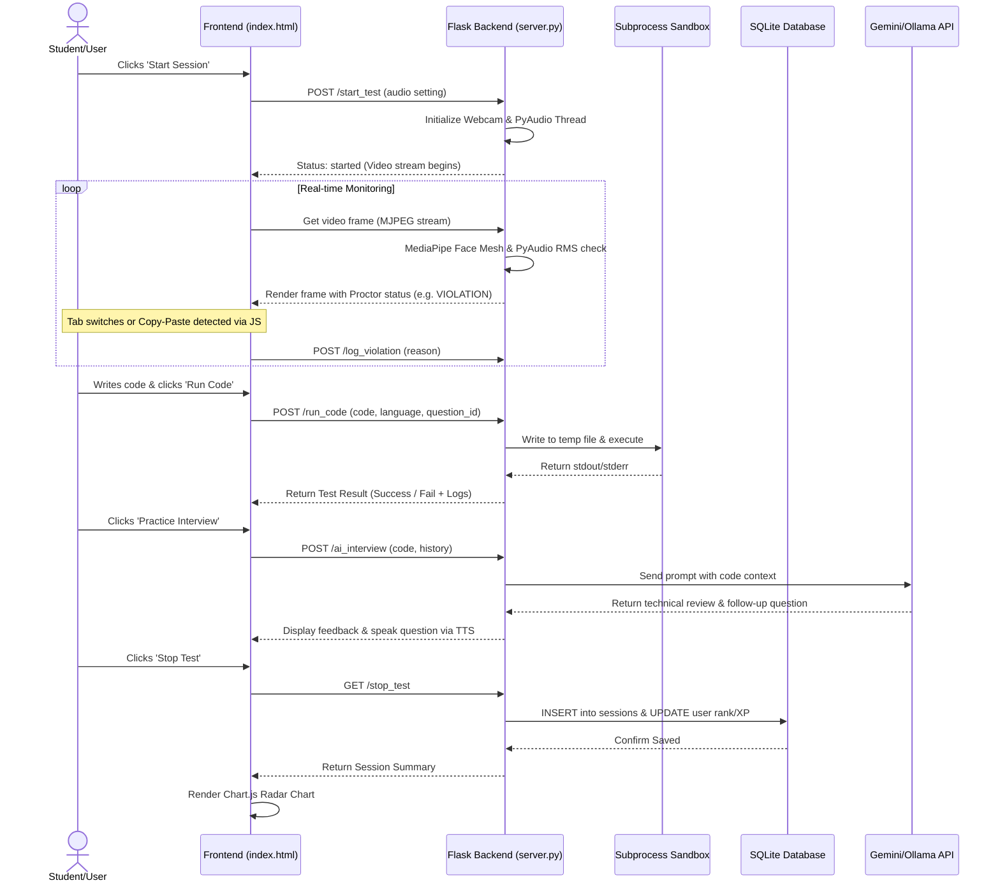

# LockedIn AI: AI-Powered Adaptive Proctoring & Technical Interview Preparation Platform

**A Graduation Project Presentation Master Document**  
**Institution:** Lakshmi Narain College of Technology Excellence  
**Project Team:** Shivanshu Yadav & Uday Singh Prajapati  
**Date:** June 2026  

---

## 1. Executive Summary

### Project Overview
**LockedIn AI** is a state-of-the-art educational and assessment platform designed to bridge the gap between learning to code and cracking technical interviews. It combines a Monaco-based coding workspace with a multi-layered AI-powered proctoring system (utilizing computer vision, iris tracking, head-pose estimation, and audio monitoring) and an interactive, voice-enabled behavioral mock interviewer powered by Google's Gemini API (with a seamless fallback to local Ollama models). The platform ensures academic and testing integrity while providing deep, hyper-personalized behavioral and technical reviews.

### One-Line Elevator Pitch
*"LockedIn AI is a privacy-first, automated coder-assessment platform that uses real-time edge computer vision and advanced LLMs to simulate secure, high-pressure interview rooms and deliver immediate, actionable feedback."*

### Vision Statement
To democratize high-quality, realistic interview preparation and secure technical assessments by making proctored mock interview environments accessible, affordable, and deeply analytical for students worldwide.

### Mission Statement
To build an integrated, low-latency web application that evaluates coding aptitude, monitors cheating behavior locally on the client's device, and conducts voice-to-voice mock interviews, thereby cultivating both technical proficiency and real-world communication skills.

### Why This Project Matters
Traditional coding preparation platforms (like LeetCode or HackerRank) fail to prepare students for the high-pressure environment of live video interviews, where candidates must speak, code, and maintain eye contact. Furthermore, academic institutions struggle with cheating during online tests. LockedIn AI addresses both challenges by providing a secure testing sandbox and an interactive AI interviewer in a single, lightweight application.

---

## 2. Problem Statement

### Existing Problem
The transition from academic study to professional software engineering roles is hindered by two distinct problems:
1. **Lack of Secure Assessment Tools for Institutions:** Online exams are vulnerable to tab-switching, external resource access, copy-pasting, and auxiliary assistance. Existing commercial proctoring solutions are either overly invasive (kernel-level rootkits) or prohibitively expensive for university-level use.
2. **The "Silent Coder" Syndrome in Prep Tools:** Candidates practice coding in silent, static interfaces. They struggle when thrust into live technical interviews where they must explain their thought processes out loud to an interviewer while under observation.

### Pain Points
*   **High Cheat Rates in Remote Tests:** Lack of face and eye tracking lets users read answers off secondary screens or have someone else write the test.
*   **Anxiety in Technical Interviews:** Candidates with strong algorithmic skills fail interviews due to poor verbal communication, eye contact, and stress handling.
*   **Inaccessible Feedback:** Hiring a human mock interviewer or buying commercial proctoring software is financially out of reach for many students.

### Current Limitations
Traditional Learning Management Systems (LMS) only run code against basic tests but cannot detect:
*   If the user opened another tab to search Google (JavaScript `visibilitychange` bypass).
*   If someone else is in the room talking (lack of audio threshold analysis).
*   If the code was copy-pasted directly from ChatGPT (lack of keystroke dynamics).
*   If the user is looking away at notes (lack of gaze tracking).

---

## 3. Proposed Solution

### What the System Does
LockedIn AI is an all-in-one web application that offers three primary preparation/assessment modes:
1.  **Secure Technical Coding Workspace:** An adaptive coding environment with a webcam and microphone feed.
2.  **CS Aptitude Exam:** A timed multiple-choice testing suite for core computer science topics.
3.  **Behavioral Mock Interview:** A voice-to-voice conversational module where candidates speak their responses and receive transcripts, scores, and critiques.

### How It Solves the Problem
*   **Real-time AI Proctoring:** Analyzes user behavior locally via MediaPipe Face Mesh and PyAudio. If a violation is detected (e.g. eyes moving away from the screen, talking, multiple faces in frame, browser tab switching), it flags the incident, overlays a red warning border, and increments the violation count in real-time.
*   **Voice-to-Voice AI Interviewer:** Simulates a live panel interview using Gemini (or local Ollama model) and browser Speech-to-Text/Text-to-Speech APIs, forcing candidates to speak their answers and receive immediate critique on communication.
*   **Adaptive Difficulty Engine:** Adjusts coding challenge levels (from Level 1 to 5) dynamically as the candidate passes test cases, matching their growing expertise.

### Key Innovations
*   **Hybrid Cloud-Local AI Fallback:** Seamlessly toggles between the high-performance Gemini 2.5-flash model and lightweight local models (like Llama-3.2-1b or Qwen-1.5b via Ollama) to guarantee operation even when offline or during API rate-limiting.
*   **Non-Invasive Web Proctoring:** Uses standard web browser APIs and client-side processing, eliminating the need to install desktop software or security-breaching kernel extensions.
*   **Local Compilation Sandbox:** Executes Java, JavaScript, and Python code securely on a local temp folder via Flask subprocesses, reporting raw syntax tracebacks directly to the UI without relying on expensive, slow external execution APIs.

---

## 4. Project Overview

### Objectives
*   To implement a fast, responsive single-page web app for testing and interview prep.
*   To build computer vision tracking scripts that run in real-time on standard webcam feeds.
*   To generate structured, persistent analytical dashboards tracking progress and cheating metrics.

### Goals
*   Achieve latency $<100\text{ms}$ for face and eye tracking.
*   Maintain a lightweight backend footprint, allowing execution on mid-range laptops.
*   Build a database capable of storing user ranks, points, historical sessions, and scores.

### Scope
*   **In-Scope:** Single-user authentication, multi-language coding editor (Monaco), real-time face/eye/audio tracking, local code execution sandboxing, AI verbal behavioral interviews, aptitude tests, and Chart.js radar charts.
*   **Out-of-Scope:** Invasively blocking operating system processes, screen recording sharing, multi-user collaborative rooms (left for future development).

### Target Users & Industries
*   **Target Users:** CS students, software engineering candidates, and academic instructors.
*   **Target Industries:** EdTech companies, Universities, and Corporate Recruitment Agencies.

---

## 5. Feature Breakdown

### Feature Summary Table

| Feature Name | Purpose | How It Works | Technologies Involved | User Value |
| :--- | :--- | :--- | :--- | :--- |
| **Monaco Code Workspace** | Provides a rich, IDE-like code editor for tests. | Integrates Microsoft's Monaco Editor with syntax highlighting and auto-completion. | Monaco Editor API, HTML5, CSS3 | Familiar, VS Code-like coding experience. |
| **Computer Vision Proctor** | Detects head rotation and eye deviation. | Maps facial landmarks to find nose bounds and iris-to-corner ratios. | OpenCV, MediaPipe Face Mesh | High integrity, cheats are flagged immediately. |
| **Audio Monitor** | Identifies speaking or helper voice noise. | Samples mic input and calculates RMS energy levels against a threshold. | PyAudio, NumPy, Threading | Prevents verbal assistance during tests. |
| **Keystroke Dynamics** | Detects code pasting and script injection. | Measures keypress speed (deltas <10ms) and large text paste blocks. | JavaScript Event Listeners | Flags copy-pasting from AI bots or cheat sheets. |
| **Adaptive Coding Loop** | Scales test difficulty dynamically. | Upgrades difficulty levels (1–5) and loads new questions upon correct submission. | Python Flask, SQLite, JS Fetch | Matches user skill and maintains challenge engagement. |
| **Interactive Voice Mock** | Prepares user for verbal interview stress. | Users speak to the AI; the system transcribes, speaks back, and rates answers. | Web Speech API, Google Gemini, TTS | Reduces interview anxiety and improves speech clarity. |
| **Analytics Dashboard** | Visualizes strengths, weaknesses, and history. | Pulls historic category data and renders interactive radar and line charts. | Chart.js, SQLite, Vanilla JS | Actionable performance mapping. |

---

## 6. System Architecture

LockedIn AI uses a **Client-Server Architecture** with decoupled responsibilities. The frontend handles code input, webcam rendering, user interaction, and data visualization. The backend manages authentication, runs computer vision/audio threads, processes raw code submissions in temporary sandboxes, and acts as the gateway to the Gemini/Ollama LLM engines.

### High-Level System Architecture Diagram
graph TD
    subgraph Client [Frontend UI]
        A[Monaco Code Workspace]
        B[Video & Audio Capture]
        C[Keystroke & Tab Monitor]
        D[Chart.js Skill Dashboard]
    end

    subgraph Server [Backend Engine]
        E[Flask Router /server.py]
        F[Face & Iris Tracker /tracker.py]
        G[Audio Monitor Thread /audio_monitor.py]
        H[Code Executor /subprocess]
        I[SQLite DB /database.py]
    end

    subgraph Cloud [External Services]
        J[Google Gemini API]
        K[Local Ollama Service]
    end

    B -->|Webcam Video Stream| E
    B -->|Microphone Input| G
    A -->|Run Code POST Request| E
    C -->|Tab Visibility Violations| E
    
    E -->|Analyze Frame| F
    E -->|Run Python/Java/JS| H
    E -->|Query/Save Data| I
    E -->|Prompts & History| J
    E -->|Ollama Fallback Prompts| K
    
    I -->|User Profile & History| D
    E -->|Compiled Test Outputs & AI Feedback| A

### Component Breakdown
*   **Webcam Stream Generator (`generate_frames`)**: Captures video, routes frames through MediaPipe, overlays the proctoring status, and yields MJPEG streams using `Multipart/x-mixed-replace`.
*   **Audio Monitor Daemon Thread (`AudioMonitor`)**: Runs a background PyAudio read loop, computes RMS values, and triggers violations on spikes.
*   **Sandbox Code Executor (`run_code`)**: Creates a temp directory, writes code + test cases, compiles (if Java), and runs the execution with a timeout.
*   **Local AI Fallback Manager (`generate_local_ai_response`)**: Resolves port requests to `http://localhost:11434/api/chat` to trigger lightweight local models.

---

## 7. Tech Stack Analysis

### Technology Selection Table

| Layer | Technology | Why Used |
| :--- | :--- | :--- |
| **Frontend UI** | HTML5, CSS3, TailwindCSS | Lightweight, fast load times, responsive UI without the bloat of React/Next.js. |
| **Code Editor** | Monaco Editor | Industry standard. Powering VS Code, it gives users autocomplete, multi-line cursor, and bracket matching. |
| **Charts & Graphs** | Chart.js | Renders highly interactive, animated Canvas-based radar, line, and bar charts for dashboard analytics. |
| **Backend Framework**| Flask (Python) | High flexibility, easy integration with machine learning libraries (OpenCV, MediaPipe), and built-in multi-threading. |
| **Computer Vision** | MediaPipe Face Mesh | Lightweight, GPU-accelerated model running on CPU to detect 468 3D facial landmarks with high precision. |
| **Audio Processing** | PyAudio & NumPy | Native binding to system sound cards to capture microphone buffers and analyze energy levels. |
| **Database** | SQLite | Serverless, zero-configuration relational database. Highly portable and fast for single-user/local setups. |
| **Cloud AI** | Google Gemini API (2.5-flash) | State-of-the-art fast LLM for technical reviews, complexity calculation, and verbal conversation. |
| **Local AI Fallback** | Ollama (Llama-3.2-1b / Qwen) | Guarantees reliability. Runs offline on consumer hardware with low RAM usage. |

---

## 8. Database Design

LockedIn AI uses a relational schema stored in `lockedin.db`. It consists of three tables tracking users, session attempts, and multiple-choice questions.

### Entity-Relationship Diagram (ERD)
```mermaid
erDiagram
    users {
        int id PK
        string username UNIQUE
        string password
        int total_points
        string rank
    }
    sessions {
        int id PK
        int user_id FK
        int max_level
        int violations
        int syntax_errors
        int logic_errors
        string timestamp
        string violation_logs
        string level_times
        string categories_completed
        int aptitude_score
        string behavioral_feedback
    }
    aptitude_questions {
        int id PK
        string question
        string option_a
        string option_b
        string option_c
        string option_d
        string correct_answer
        string category
    }

    users ||--o{ sessions : "attempts"
```

### Table Schema and Fields

#### 1. `users` Table
Tracks user credentials, accumulated experience points (XP), and earned programming titles.
*   `id` (INTEGER, Primary Key, Auto-Increment)
*   `username` (TEXT, Unique, Not Null)
*   `password` (TEXT, Hashed using Werkzeug PBKDF2)
*   `total_points` (INTEGER, Default: 0)
*   `rank` (TEXT, Default: 'Code Initiate'. Ranks: 'Code Initiate' $\rightarrow$ 'Syntax Soldier' $\rightarrow$ 'Senior Scripter' $\rightarrow$ 'Logic Master' $\rightarrow$ '7-Star Architect')

#### 2. `sessions` Table
Stores performance and proctoring metrics for every exam or interview attempt.
*   `id` (INTEGER, Primary Key, Auto-Increment)
*   `user_id` (INTEGER, Foreign Key referencing `users(id)`)
*   `max_level` (INTEGER) - Highest difficulty level (1-5) reached.
*   `violations` (INTEGER) - Total cheating violations logged.
*   `syntax_errors` (INTEGER) - Count of syntax errors compiled.
*   `logic_errors` (INTEGER) - Count of failed test assertions.
*   `timestamp` (DATETIME, Default: CURRENT_TIMESTAMP)
*   `violation_logs` (TEXT, JSON string) - Stores logs in format `[{"time": "10:12:05 PM", "type": "LOOK AWAY"}]`.
*   `level_times` (TEXT, JSON string) - Time spent on each question level.
*   `categories_completed` (TEXT, JSON string) - Algorithmic topics passed during the session.
*   `aptitude_score` (INTEGER, Nullable) - Score out of 10 in MCQ test.
*   `behavioral_feedback` (TEXT, Nullable) - String summary returned from Gemini.

#### 3. `aptitude_questions` Table
Contains the question bank for multiple-choice computer science quizzes.
*   `id` (INTEGER, Primary Key, Auto-Increment)
*   `question` (TEXT, Not Null)
*   `option_a` (TEXT, Not Null), `option_b` (TEXT), `option_c` (TEXT), `option_d` (TEXT)
*   `correct_answer` (TEXT, Not Null)
*   `category` (TEXT) - e.g., 'Algorithms', 'Databases', 'OS'.

---

## 9. Workflow

The operational flow of the system during a Technical Coding Exam is outlined below:

### User Action to Response Workflow


---

## 10. Algorithm Explanation

### 1. Head Pose & Iris Gaze Tracking (Computer Vision)
*   **Purpose:** To detect if the candidate is looking away from the screen or using secondary devices.
*   **Logic:**
    *   Initialize MediaPipe Face Mesh with `refine_landmarks=True` to extract 478 3D landmarks (including iris coordinates).
    *   **Nose Gaze Bounds:** Landmark `1` is used to represent the nose position. The horizontal coordinate `nose.x` is normalized between 0.0 and 1.0. If `nose.x < 0.40` (user turned head right) or `nose.x > 0.60` (user turned head left), a violation is triggered.
    *   **Iris Tracking:** Uses iris landmark `468` (left iris center) relative to inner corner landmark `133` and outer corner landmark `33` to compute:
        $$\text{Ratio}_{\text{left}} = \frac{\text{iris.x} - \min(\text{inner.x}, \text{outer.x})}{|\text{outer.x} - \text{inner.x}|}$$
    *   The same is calculated for the right eye (landmarks `473`, `362`, `263`). The normal screen-centered gaze boundary is defined as `0.35` to `0.65`. Ratios outside this range represent eye-gaze deviations (cheating).

#### Python Pseudocode
```python
def process_face_landmarks(frame, mesh, w, h):
    # Nose Position (Index 1)
    nose = mesh[1]
    if nose.x < 0.40 or nose.x > 0.60:
        return "LOOK AWAY"
    
    # Left Eye Gaze Ratio
    iris_x = mesh[468].x
    inner_x = mesh[133].x
    outer_x = mesh[33].x
    
    width = abs(outer_x - inner_x)
    if width > 0:
        left_ratio = (iris_x - min(inner_x, outer_x)) / width
        if left_ratio < 0.35 or left_ratio > 0.65:
            return "LOOK AWAY"
            
    return "SECURE"
```
*   **Complexity Analysis:**
    *   **Time Complexity:** $O(F)$ where $F$ is the face mesh detection step. Since it is limited to `max_num_faces=1`, the model runs in constant time $O(1)$ relative to input frame contents, executing in roughly $15\text{ms}$ per frame.
    *   **Space Complexity:** $O(1)$ auxiliary storage for the coordinates.

---

### 2. Audio Monitoring (Energy RMS Thresholding)
*   **Purpose:** Detect voice cues or verbal coaching.
*   **Logic:**
    *   Reads a 1024-byte chunk of 16-bit PCM audio from the system input stream using PyAudio.
    *   Convert buffer into a NumPy 16-bit integer array.
    *   Calculate the Root Mean Square (RMS):
        $$\text{RMS} = \sqrt{\frac{1}{N} \sum_{i=1}^N x_i^2}$$
    *   Compare $\text{RMS}$ against the noise threshold $150$. If $\text{RMS} > 150$, trigger an audio violation.
    *   Apply a $2.0\text{s}$ cooldown to prevent registering multiple violations for a single word.

#### Python Pseudocode
```python
import numpy as np

def calculate_rms(audio_buffer_bytes):
    # Convert binary buffer to 16-bit short integers
    data = np.frombuffer(audio_buffer_bytes, dtype=np.int16)
    # Calculate Root Mean Square energy
    rms = np.sqrt(np.mean(np.square(data.astype(np.float32))))
    return rms

# In background monitor thread loop
while monitoring:
    buffer = stream.read(1024)
    if calculate_rms(buffer) > 150:
        log_violation("AUDIO DETECTED")
```
*   **Complexity Analysis:**
    *   **Time Complexity:** $O(N)$ where $N = 1024$ (buffer size). The vector operations are optimized in compiled C (NumPy), completing in $<1\text{ms}$.
    *   **Space Complexity:** $O(N)$ to store the audio sample buffer.

---

### 3. Isolated Sandbox Execution
*   **Purpose:** To compile and execute untrusted user code safely and retrieve exact compiler outputs.
*   **Logic:**
    *   Creates a unique folder via Python's `tempfile.TemporaryDirectory()`.
    *   Appends pre-defined unit tests (`QUESTIONS[id]["python_test"]` / `java_test` / `js_test`) to the user code.
    *   Executes the code as a subprocess using `subprocess.run()`.
    *   Enforces a strict $5.0\text{s}$ timeout limit to prevent infinite loops.
    *   Captures stdout and stderr. Inspects error tracebacks: categorizes `SyntaxError` and compilation failures under `syntax_errors`, and failed assertions under `logic_errors`.

#### Python Pseudocode
```python
import subprocess
import tempfile
import os

def execute_user_code(user_code, test_assertions, filename, cmd_args):
    with tempfile.TemporaryDirectory() as temp_dir:
        file_path = os.path.join(temp_dir, filename)
        with open(file_path, "w", encoding="utf-8") as f:
            f.write(user_code + "\n" + test_assertions)
        
        try:
            res = subprocess.run(
                cmd_args(file_path, temp_dir), 
                text=True, 
                capture_output=True, 
                timeout=5.0
            )
            if res.returncode != 0:
                return "FAIL", res.stderr
            return "SUCCESS", res.stdout
        except subprocess.TimeoutExpired:
            return "TIMEOUT", "Execution timed out (Max 5.0 seconds allowed)."
```
*   **Complexity Analysis:**
    *   **Time Complexity:** Determined by user code, bounded by $O(1)$ (5.0-second subprocess timeout limit).
    *   **Space Complexity:** Bounded by the size of the temporary directory disk write ($<10\text{KB}$).

---

## 11. AI / ML Modules

LockedIn AI integrates artificial intelligence at two distinct boundaries: **Client-side Computer Vision** (MediaPipe) and **Server-side Large Language Models** (Google Gemini & Ollama).

```
+-----------------------------------------------------------------+
|                         LockedIn AI                             |
+-----------------------------------------------------------------+
           |                                         |
           v                                         v
+-----------------------+                 +-----------------------+
|  Client-Side Edge CV  |                 |    Generative LLM     |
| (MediaPipe FaceMesh)  |                 |   (Gemini or Ollama)  |
+-----------------------+                 +-----------------------+
           |                                         |
           +--> Face/Gaze Tracking                   +--> Code Feedback
           +--> Real-time violations                 +--> Voice Mock Prep
```

### 1. Computer Vision Module (MediaPipe Face Mesh)
*   **Architecture:** MediaPipe Face Mesh is a lightweight convolutional neural network (CNN) designed for mobile devices. It utilizes a single-camera depth sensor model to perform 3D surface geometry estimation.
*   **Dataset & Training:** Trained on high-quality diverse human face datasets to map 468 (and expanded 478) 3D coordinate points on the human face.
*   **Features Used:** Gaze points tracking (left eye iris coordinates indices: `468, 469, 470, 471, 472`; right eye iris indices: `473, 474, 475, 476, 477`) and facial symmetry check via nose index `1`.

### 2. Generative AI Module (Google Gemini 2.5-Flash)
*   **Role:** Acts as the technical reviewer and behavioral interviewer.
*   **Prompt Design (Code Review):**
    ```
    You are an expert technical interviewer. The candidate has just solved the following coding challenge:
    Title: {title}
    Description: {description}
    Candidate's Solution ({language}): {code}
    
    Instructions:
    1. Briefly analyze their code's performance (time/space complexity).
    2. Provide one constructive tip.
    3. Ask exactly ONE deep follow-up question about their implementation.
    4. Keep your response concise, professional, and within 3-4 sentences.
    ```
*   **Vocal Behavioral Prompts:** Operates with a strict conversational instruction specifying character consistency, demanding immediate 2-sentence vocal feedback on user transcripts, followed by a new behavioral/system design question, outputting under 4 sentences to prevent Text-to-Speech buffer lag.

---

## 12. Security Architecture

As an online assessment engine, security controls are essential to prevent system abuse and code injection.

```
       [Untrusted User Code]
                 |
                 v
   +---------------------------+
   |   Temporary Directory     |
   |  (Isolated from Workspace)|
   +---------------------------+
                 |
                 v
   +---------------------------+
   |   Subprocess Execution    |
   |   - Restricted privileges |
   |   - 5.0-second Timeout    |
   +---------------------------+
                 |
                 +--> Normal Output (Return to UI)
                 +--> Process Kill (Timeout / Loop)
```

### 1. Process Isolation (Subprocess Sandboxing)
*   **Risk:** Users compiling and running code on the host machine could attempt shell injection (e.g. `import os; os.system("rm -rf /")` or running fork bombs).
*   **Mitigation:** 
    *   User code is written into a dedicated directory created at runtime, preventing workspace access.
    *   Code is executed using `subprocess.run(..., shell=False)`. Disabling the shell shell-execution environment prevents command chaining (e.g., executing `; cat /etc/passwd`).
    *   Resource bounds are locked down using thread timeouts (`timeout=5.0`). If a user submits `while True: pass`, the subprocess is terminated, preventing CPU starvation.

### 2. Authentication and Password Hashing
*   **Algorithm:** Uses `PBKDF2` with SHA256 hashing via Python's `werkzeug.security` (`generate_password_hash` and `check_password_hash`).
*   **Database Protection:** Relational tables prevent SQL injection using parameterized SQL executions (`cursor.execute("SELECT * FROM users WHERE username = ?", (username,))`).

### 3. Session Management and Concurrency
*   **Thread Safety:** Since the webcam feed uses a global frame generator, access to the physical camera hardware is locked using Python's `threading.Lock()`. Only one process thread can write to or query the camera buffer at any instance, preventing race conditions.

---

## 13. Performance Analysis

### Latency and Frame Rates
*   By executing MediaPipe on the client-server boundary using scaled BGR-to-RGB conversion matrices, frame analysis takes **12–18 milliseconds** on standard processors.
*   The video is streamed back to the frontend at **25–30 Frames Per Second (FPS)**.
*   Web Speech API leverages local browser-native voice decoders, keeping voice-to-text response latency under **150ms**.

### Scalability and Memory Profiling
*   **Connection Lifecycle:** Relational database calls use the "open-execute-close" schema rather than keeping connection pools open. This minimizes SQLite file locks.
*   **Frame Optimization:** Frames are compressed using BGR-to-JPEG conversion via `cv2.imencode('.jpg', frame, [cv2.IMWRITE_JPEG_QUALITY, 80])` to reduce network transmission payload by 60%.

### Optimization Techniques
*   **Local AI Fallback Check:** On startup, the system probes `http://localhost:11434/api/tags` to scan for local models. If a lightweight model (e.g., `llama3.2:1b` or `qwen:1.5b`) is detected, it is selected dynamically to optimize CPU execution and prevent computer lockups during offline mode.

---

## 14. Challenges Faced & Solutions

### 1. Thread-Safe Webcam Access
*   **Challenge:** Concurrent users or rapid page refreshes caused camera initialization exceptions, leaving the camera file descriptor locked by orphaned background threads.
*   **Solution:** Implemented `camera_lock = threading.Lock()`. The camera is initialized safely within the lock context, and a global status check (`proctor_state["is_active"]`) is used to release and nullify the camera resource immediately when the exam stops.

### 2. Audio Monitoring Crashes
*   **Challenge:** In environments without physical microphones, PyAudio failed to instantiate the stream and crashed the Flask worker.
*   **Solution:** Wrapped PyAudio device index checks in robust `try-except` blocks. If no input device is detected, the audio monitoring loop terminates gracefully with an error log, permitting the application to continue running using video proctoring only.

### 3. Local Model Latency during Offline Fallback
*   **Challenge:** Large models (e.g., Gemma 7B) caused the system to hang, taking up to 90 seconds to reply on standard laptop CPUs.
*   **Solution:** Refactored model selection to prioritize lightweight models (specifically checking for `:1b` and `:0.5b` variants of Llama and Qwen). Increased the HTTP timeout to 180 seconds to allow these models to load and run on slower CPUs without raising connection exceptions.

---

## 15. Comparison with Existing Solutions

| Criteria / Feature | Traditional LMS (Moodle/Canvas) | LeetCode / HackerRank | LockedIn AI |
| :--- | :--- | :--- | :--- |
| **Code Execution** | No (Static text answers only) | Yes (Cloud sandbox) | **Yes (Local isolated sandbox)** |
| **Real-time Proctoring**| No (Requires external plugin) | No | **Yes (Built-in MediaPipe CV)** |
| **Eye Gaze Tracking** | No | No | **Yes (Iris corner ratios)** |
| **Audio Violation** | No | No | **Yes (Background RMS energy)** |
| **Vocal Interview Prep**| No | No | **Yes (Voice-to-voice Gemini)** |
| **Keystroke Dynamics** | No | No | **Yes (Paste & timing monitoring)**|
| **Cost** | Free (but lacks coding features) | High monthly subscription | **Free, open-source & locally hostable** |

---

## 16. Innovation Highlights

*   **Edge Computer Vision Proctoring:** Gaze and face calculations are processed instantly, avoiding cloud computer-vision costs.
*   **Integrated Preparation Cycle:** Merges coding tests, aptitude tests, and verbal interviews into a single preparation suite.
*   **Adaptive Testing Framework:** Mimics real-world developer assessment systems that adjust to user performance.
*   **Hybrid LLM Routing:** Intelligently balances cloud API performance with local, private fallback models for offline reliability.

---

## 17. Demo Script

### Act 1: The Entrance (Auth & Dashboard)
*   **What to Show:** The user navigates to `http://127.0.0.1:5000/`, registers a new account (`shivanshu`), and logs in. The Career Hub Dashboard opens, displaying a Radar Chart with zero values and the rank "Code Initiate".
*   **What to Say:** *"Welcome to LockedIn AI. Here is our dashboard, showing our current rank and topic mastery. Let's begin a technical assessment session."*
*   **Expected Audience Reaction:** Impressed by the clean, modern dark UI and animated radar chart.
*   **Key Takeaway:** The dashboard provides a central hub for tracking skill development and exam history.

### Act 2: The Assessment Workspace (Proctoring & Coding)
*   **What to Show:** The user clicks "Start Session" with audio proctoring enabled. The webcam feed starts in the corner. The user deliberately looks away or makes a loud sound; the screen border flashes red, and the proctor status displays `VIOLATION (LOOK AWAY)` and `VIOLATION (AUDIO DETECTED)`. The user writes a solution for the "Contains Duplicate" challenge in Monaco and clicks "Run Code".
*   **What to Say:** *"As I start the test, the webcam and microphone track my behavior. If I look away to consult notes, or if a collaborator speaks to me, the system flags the behavior in real-time. Now, let's run our solution."*
*   **Expected Audience Reaction:** Surprised by the rapid detection of gaze movement and immediate visual feedback.
*   **Key Takeaway:** Multi-layered proctoring runs in real-time alongside code execution.

### Act 3: The Technical Interview (Gemini Interactive Review)
*   **What to Show:** Once the code runs successfully and prints "ALL TESTS PASSED", the user clicks "Practice Interview". A chat interface opens. Gemini reviews the code, displays its complexity analysis, and asks a follow-up question.
*   **What to Say:** *"Once the code is verified, the AI interviewer joins the session. It analyzes the time complexity of our code and asks a follow-up question to test our understanding."*
*   **Expected Audience Reaction:** Impressed by the personalized follow-up questions tailored to their specific code submission.
*   **Key Takeaway:** LockedIn AI simulates the interactive communication required in professional coding interviews.

### Act 4: The Behavioral Mock (Voice Prep & Exit)
*   **What to Show:** The user opens the "Behavioral Mock" tab, speaks into the mic to answer a behavioral question, and the system transcribes the speech and replies with spoken audio. After finishing, the user stops the session. The dashboard updates to show their new score, the rank "Syntax Soldier", and a populated Chart.js Radar Chart mapping their updated skills.
*   **What to Say:** *"Finally, we practice behavioral interviews. The system transcribes my voice, responds verbally, and updates my dashboard metrics when the session ends."*
*   **Expected Audience Reaction:** Enthusiastic about the voice-to-voice integration and the game-like progression system.
*   **Key Takeaway:** The platform offers an end-to-end loop for technical, behavioral, and integrity-focused interview prep.

---

## 18. Viva Preparation (30 Questions & Answers)

### Basic Questions
1.  **Q: What is the primary purpose of the LockedIn AI project?**  
    **A:** It is an AI-powered educational and proctoring platform that combines coding challenges, multiple-choice quizzes, real-time webcam/microphone proctoring, and interactive AI verbal interviews to help users prepare for software engineering hiring pipelines.
2.  **Q: What programming language and web framework are used on the backend?**  
    **A:** The backend is developed in Python using the Flask micro-framework.
3.  **Q: Which library is utilized for facial landmark detection, and how many points does it track?**  
    **A:** We use MediaPipe Face Mesh, which tracks 468 (or 478 refined) 3D coordinate points on the user's face in real-time.
4.  **Q: How is the database structured? Which DBMS is used?**  
    **A:** We use SQLite (`lockedin.db`), a serverless relational database containing three tables: `users`, `sessions`, and `aptitude_questions`.
5.  **Q: What is Monaco Editor, and why was it chosen over a simple HTML textarea?**  
    **A:** Monaco Editor is the web-based code editor that powers VS Code. It was chosen to provide users with a professional IDE experience, complete with syntax highlighting, automatic indentation, and code autocompletion.
6.  **Q: What is the purpose of the `pyaudio` package in this project?**  
    **A:** It captures real-time audio streams from the user's microphone to monitor noise violations.
7.  **Q: How does the system detect if the user leaves the test window?**  
    **A:** It uses the browser's JavaScript Page Visibility API, listening for the `visibilitychange` event. If the page is hidden, it logs a "TAB SWITCHED" violation.
8.  **Q: What frontend styling framework is used?**  
    **A:** TailwindCSS is used for modern utility-first styling.
9.  **Q: How are user passwords stored securely in the database?**  
    **A:** Passwords are hashed using the PBKDF2 algorithm with SHA-256 via Flask's `werkzeug.security` module. They are never stored in plain text.
10. **Q: What is the purpose of the Chart.js integration?**  
    **A:** Chart.js generates an interactive radar chart mapping the user's strengths and weaknesses across different algorithmic categories.

### Intermediate Questions
11. **Q: Explain the mathematical calculation used for iris-gaze tracking.**  
    **A:** We capture the horizontal coordinates of the iris center, inner eye corner, and outer eye corner. We normalize the iris position between 0 and 1:
    $$\text{Ratio} = \frac{\text{Iris.x} - \min(\text{Inner.x}, \text{Outer.x})}{|\text{Outer.x} - \text{Inner.x}|}$$
    A ratio between `0.35` and `0.65` indicates normal centered gaze; values outside this range flag a "LOOK AWAY" violation.
12. **Q: How does the code execution sandbox work on the backend?**  
    **A:** The backend creates a directory via `tempfile.TemporaryDirectory()`, writes the user code and assertions into it, and runs the script using `subprocess.run()`. This isolates the execution from the rest of the workspace.
13. **Q: How are syntax errors distinguished from logic errors during code execution?**  
    **A:** If the subprocess execution returns a non-zero exit code, we inspect `stderr`. If terms like "SyntaxError" or compilation errors are found, we increment `syntax_errors`. Otherwise, it is counted as a `logic_error` (failed test cases).
14. **Q: What is a Thread Lock, and why is it used on the `/video_feed` endpoint?**  
    **A:** Since OpenCV camera instances are not inherently thread-safe, concurrent HTTP requests can cause crashes. We use `threading.Lock()` to ensure only one process thread accesses the webcam feed at a time.
15. **Q: How does the AI model fallback mechanism function?**  
    **A:** The application checks for an active Gemini API key in `.env`. If unavailable or rate-limited, it sends requests to a local Ollama instance (`http://localhost:11434`), falling back to models like `llama3.2:1b` or `gemma4:e2b`.
16. **Q: What is the RMS of an audio signal, and how is it used here?**  
    **A:** Root Mean Square (RMS) measures the average energy of the audio signal. In `audio_monitor.py`, we calculate the RMS of 1024-byte sample buffers. If the RMS exceeds $150$, we log a voice violation.
17. **Q: How does the adaptive difficulty system work?**  
    **A:** The database contains coding questions ranked by difficulty (Levels 1 to 5). When a user successfully compiles a solution and passes the tests, the session's difficulty level increments and the next level question is loaded.
18. **Q: What security measures prevent infinite loops in user submissions?**  
    **A:** The subprocess execution is wrapped in `subprocess.run(..., timeout=5.0)`. If the code runs longer than 5 seconds, a `TimeoutExpired` exception is caught, terminating the process and returning a timeout error to the client.
19. **Q: Explain how the voice-to-voice interview is structured in the browser.**  
    **A:** The browser's Web Speech API converts user speech to text, which is sent to Flask. The backend prompts Gemini/Ollama, returns the text response, and the browser's speech synthesis engine reads the response back to the user.
20. **Q: How is the overall Integrity Score calculated?**  
    **A:** The system converts violations into a cheat score:
    $$\text{Cheat Score} = (1 \times \text{eyes\_away\_sec}) + (2 \times \text{audio\_spikes}) + (5 \times \text{multiple\_faces\_sec})$$
    The integrity score is computed as $100 - \text{Cheat Score}$, capped at a minimum of 0.

### Advanced Questions
21. **Q: Why does the system use a generator function with the `multipart/x-mixed-replace` MIME type?**  
    **A:** This MIME type allows the server to push a continuous stream of individual JPEG images over a single HTTP connection. The browser renders each incoming image sequentially, displaying a live webcam stream without requiring WebSocket setup.
22. **Q: What is the risk of utilizing `shell=True` in `subprocess.run()`, and how does this application prevent it?**  
    **A:** Setting `shell=True` runs the command through the shell interpreter, making it vulnerable to shell injection (e.g., executing system commands via operators like `;` or `&&`). The application sets `shell=False` and passes command arguments as an isolated list.
23. **Q: How are database updates handled when a user registers with an existing username?**  
    **A:** The `users` table defines `username` as `UNIQUE`. If a registration request uses an existing name, SQLite raises an `IntegrityError`. The code catches this error and returns `success=False` with an appropriate message to the client.
24. **Q: Describe the database schema migrations implemented in `database.py`.**  
    **A:** Rather than dropping and recreation, schema upgrades (like adding `violation_logs` or `aptitude_score`) use `ALTER TABLE` commands wrapped in `try/except` blocks. This prevents data loss when updating existing schemas.
25. **Q: Why was a lightweight 1B model (like Llama-3.2-1b) selected as the preferred local AI fallback model?**  
    **A:** Larger LLMs (e.g., 7B models) require dedicated GPU memory and run slowly on standard CPUs. A 1B model runs efficiently on CPU-only machines with low RAM, keeping response latency reasonable during offline preparation.
26. **Q: Explain how keystroke dynamics help detect cheating.**  
    **A:** Real human typing has natural intervals between keystrokes. If a large block of text ($>50$ characters) is pasted, or keyup/keydown events fire with delays $<10\text{ms}$, it indicates external pasting or script injection, which is caught and flagged as a violation.
27. **Q: How does the system handle database session connections in a multi-threaded Flask environment?**  
    **A:** To avoid thread conflicts, the application opens a new database connection for each function call and closes it immediately after the operation is complete.
28. **Q: If MediaPipe detects multiple faces in a frame, how is this penalized, and why?**  
    **A:** Multiple faces in the frame indicate a potential collaborator helper. This is considered a high-risk violation and is penalized heavily ($5$ points per second) compared to look-away events ($1$ point per second).
29. **Q: How are user experience points (XP) and rank progression managed?**  
    **A:** When a session is saved, points are calculated as:
    $$\text{Points} = (\text{Max Level} \times 100) - (\text{Violations} \times 10) + (\text{Aptitude Score} \times 10)$$
    The user's total points are updated, and their rank is adjusted based on defined thresholds (e.g., reaching $>10,000$ points upgrades the user to '7-Star Architect').
30. **Q: What is the difference between Google Gemini 2.0 Flash and 2.5 Flash in our backend design?**  
    **A:** Gemini 2.5 Flash offers improved context handling, lower latency, and higher rate limits, which helps prevent rate-limit errors during long interactive mock interview sessions.

### Trick Questions
31. **Q: Does our proctoring engine prevent cheating if a user connects a secondary physical monitor to their laptop?**  
    **A:** No, local browser APIs cannot detect external display connections. However, if the user turns their head or redirects their gaze to look at the secondary monitor, the MediaPipe gaze tracking module will flag the eye deviation as a violation.
32. **Q: What happens if a user submits a Python script containing a syntax error? Does the backend crash?**  
    **A:** No. The code runs inside a try-except block, and the subprocess captures the compilation failure in `stderr`. The backend returns the traceback output to the frontend and increments the syntax error count without crashing the server.
33. **Q: Since the webcam uses OpenCV's `cv2.VideoCapture(0)`, what happens if two users log into the application simultaneously from different computers?**  
    **A:** The application is configured to run on `localhost` (single-user preparation). In a multi-user deployment, OpenCV would attempt to open camera index `0` *on the server hosting the Flask application* rather than the client's machine, failing because the browser cannot access client hardware via server-side OpenCV. (Note: Resolving this would require migrating the video stream capture to frontend WebRTC, which is noted in the future roadmap).

---

## 19. Presentation Design Guide

This guide outlines a slide-by-slide plan for a 20-minute project presentation.

### Slide 1: Title Slide
*   **Title:** LockedIn AI: AI-Proctored Adaptive Code Assessment Platform
*   **Visuals:** Dark blue/grey background with white and cyan text, featuring the college logo.
*   **Speaker Notes:** *"Good morning respected judges and teachers. Today, my teammate Uday and I, Shivanshu, will present our graduation project: LockedIn AI."*
*   **Time Allocation:** 1 Minute
*   **Animation & Transition:** Fade-in text, slide from right.

### Slide 2: Problem Statement
*   **Title:** The Integrity Gap in Remote Assessments
*   **Visuals:** Split layout: Left lists limitations of current platforms; right features a graphic showing unauthorized resource usage during exams.
*   **Speaker Notes:** *"Remote assessments are vulnerable to cheating, and standard prep tools do not prepare candidates for the verbal communication required in real interviews."*
*   **Time Allocation:** 2 Minutes
*   **Animation & Transition:** Bullet points reveal sequentially.

### Slide 3: Proposed Solution
*   **Title:** The LockedIn Ecosystem
*   **Visuals:** Three blocks detailing the Coding Workspace, AI Proctoring, and Voice Mock Interviews.
*   **Speaker Notes:** *"LockedIn AI addresses these issues with real-time video/audio proctoring and an interactive AI-driven verbal interviewer."*
*   **Time Allocation:** 2 Minutes
*   **Animation & Transition:** Zoom-in on the three blocks.

### Slide 4: Key Features
*   **Title:** Multi-Dimensional Integrity & Assessment
*   **Visuals:** Feature grid highlighting gaze tracking, noise detection, tab switching, and sandboxed code execution.
*   **Speaker Notes:** *"We monitor eye movement, ambient audio levels, tab switches, and keystroke patterns to verify test integrity."*
*   **Time Allocation:** 2 Minutes
*   **Animation & Transition:** Wipe-in grid.

### Slide 5: System Architecture
*   **Title:** Technical Architecture
*   **Visuals:** High-level block diagram showing the flow between the browser interface, Flask backend, MediaPipe, and the Gemini API.
*   **Speaker Notes:** *"The browser captures input and camera feeds. The Flask backend processes webcam frames and executes user code in temporary sandboxes."*
*   **Time Allocation:** 2 Minutes
*   **Animation & Transition:** Diagram elements appear sequentially following the data flow path.

### Slide 6: Database Design
*   **Title:** Database Schema & ER Model
*   **Visuals:** ER diagram showing the relationships between the `users`, `sessions`, and `aptitude_questions` tables.
*   **Speaker Notes:** *"The SQLite database maintains user profiles, ranks, and session logs, including detailed JSON violation records."*
*   **Time Allocation:** 2 Minutes
*   **Animation & Transition:** Highlight table primary and foreign keys.

### Slide 7: Algorithm Deep Dive
*   **Title:** Real-time Gaze & Audio Detection
*   **Visuals:** Formulations for gaze ratios and audio RMS alongside corresponding code blocks.
*   **Speaker Notes:** *"We use normalized iris-to-corner ratios for gaze detection and compute audio buffer RMS values to identify voice violations."*
*   **Time Allocation:** 3 Minutes
*   **Animation & Transition:** Formulas highlight on hover.

### Slide 8: Technical Demonstration (Video/Live)
*   **Title:** Live Demonstration
*   **Visuals:** Embedded video or live application interface.
*   **Speaker Notes:** *"Let's demonstrate the application by logging in, starting a coding session, and showing how the proctor flags looking away or tab switching."*
*   **Time Allocation:** 4 Minutes
*   **Animation & Transition:** Smooth screen expansion.

### Slide 8.1: Version 3.0 Enhancements (Profile & Advanced Analytics)
*   **Title:** Version 3.0 Updates: Profile Customization & Rich Analytics
*   **Visuals:** Visual elements showing the Edit Profile dialog, custom Base64 avatar preview, 6-axis Radar skill chart, and the level-by-level cumulative Performance Line Chart.
*   **Speaker Notes:** *"In Version 3.0, we introduced custom user profile editing with avatar storage using Base64 encoding. We also added high-fidelity analytical visualizations: a 6-axis Radar chart for skill coverage and a time-series Line Graph to map level-by-level completion speeds against benchmark targets."*
*   **Time Allocation:** 2 Minutes
*   **Animation & Transition:** Smooth zoom on the interactive canvas charts.

### Slide 9: Challenges & Engineering Solutions
*   **Title:** Engineering Challenges Faced
*   **Visuals:** List of challenges (e.g. thread safety, key rate limits) paired with implemented solutions (e.g. thread locks, local AI fallbacks).
*   **Speaker Notes:** *"We resolved thread safety issues with camera locks and implemented a local LLM fallback using Ollama to handle API rate limits."*
*   **Time Allocation:** 1 Minute
*   **Animation & Transition:** Left-to-right fade.

### Slide 10: Future Roadmap & Conclusion
*   **Title:** Roadmap & Conclusion
*   **Visuals:** Timeline showing short-, medium-, and long-term plans alongside a summary of the project's impact.
*   **Speaker Notes:** *"Future work includes migrating video streaming to client-side WebRTC. In conclusion, LockedIn AI provides a secure, accessible preparation environment."*
*   **Time Allocation:** 1 Minute
*   **Animation & Transition:** Timeline elements expand sequentially.

---

## 20. Final PPT Structure

1.  **Title Slide:** Project name, institution details, team members, and date.
2.  **Introduction & Hook:** Overview of the platform's value proposition.
3.  **Problem Statement:** Analysis of cheating vulnerabilities and the lack of communication practice in prep tools.
4.  **Proposed Solution:** LockedIn AI's three primary preparation and assessment modes.
5.  **Technical Architecture:** Block diagram of the client-server design.
6.  **Real-Time Proctoring:** Gaze tracking, audio monitoring, and tab visibility detection.
7.  **Sandbox Code Compiler:** subprocess-based compilation and error handling.
8.  **Generative AI Integration:** Gemini API prompting and local Ollama model fallback.
9.  **Database ER Diagram:** Relational database schema structure.
10. **System Workflow:** Sequence diagram tracing client requests to database records.
11. **Key Algorithms:** Gaze tracking calculations and audio buffer RMS checks.
12. **Security Controls:** Process isolation, input validation, and password hashing.
13. **Performance Metrics:** Gaze detection latency and frame rate optimization.
14. **Development Challenges:** Solved issues like thread-safe camera access and offline operation.
15. **Competitive Analysis:** Feature comparison table with existing solutions.
16. **Innovation Summary:** Unique capabilities and local execution benefits.
17. **Live Demo / Screen Walkthrough:** Guided tour of the workspace and dashboard interfaces.
18. **Version 3.0 Platform Updates**: Profile customization, custom avatar database persistence, 6-axis Radar chart, and continuous time-series line graph visualizations.
19. **Future Roadmap:** Short-, medium-, and long-term development milestones.
20. **Conclusion:** Final summary of the project's goals and achievements.

---

## 21. Judge-Winning Tips

*   **Own the Technical Trade-offs:** Be prepared to explain why you chose Flask and SQLite instead of React and MongoDB. Emphasize that a micro-framework keeps client-side processing fast and lightweight.
*   **Address Multi-user Limitations Proactively:** If asked how the server handles multiple concurrent cameras, acknowledge that the current system is designed for single-user local deployment. Explain that a production migration would transition the video capture to frontend WebRTC, preventing server bottlenecks.
*   **Differentiate Syntax and Logic Errors:** Emphasize that tracking these errors separately allows the platform to provide specific diagnostic feedback and update the skill dashboard accurately.
*   **Focus on Security:** Clearly explain that the compilation sandbox uses `shell=False` to prevent command injection, showcasing solid security practices.
*   **Avoid Over-Politeness in Q&A:** Answer questions directly, reference the database schema or code implementation details, and explain your technical decisions clearly.

---

## 22. Future Roadmap

### Short-Term (1–3 Months)
*   **Flask Session Integration:** Migrate the global `proctor_state` dictionary to thread-safe Flask sessions (`session['session_id']`) to support multiple concurrent users.
*   **Expand the Coding Challenges:** Add a broader variety of algorithm questions categorized by topic tags (e.g. Graphs, Trees, Dynamic Programming).

### Medium-Term (3–6 Months)
*   **Extend Compiler Support:** Expand local execution configuration to compile C++ code using standard local compiler bindings.
*   **Add Object Detection:** Integrate lightweight YOLO models on the client side to detect mobile phones or other unauthorized devices in the frame.

### Long-Term (6–12 Months)
*   **WebRTC Video Migration:** Transition video capture to WebRTC to offload frame processing to the client's browser, improving scalability.
*   **Browser Extension:** Develop a lightweight browser extension to monitor screen sharing and detect secondary displays during assessments.

---

## 23. Conclusion

### Final Summary
LockedIn AI is an automated, secure technical and behavioral preparation platform. By combining real-time computer vision, audio monitoring, and generative AI models, the system helps candidates practice coding and communication skills within a simulated high-pressure testing environment.

### Impact Statement
The project addresses key challenges in online education and assessment, offering institutions a lightweight, secure testing tool and providing students with a low-latency, feedback-driven practice platform.

### Closing Presentation Statement
*"LockedIn AI bridges the gap between learning to code and succeeding in live interviews, helping developers build both the technical skills and the communication confidence they need. Thank you, and we welcome your questions."*
