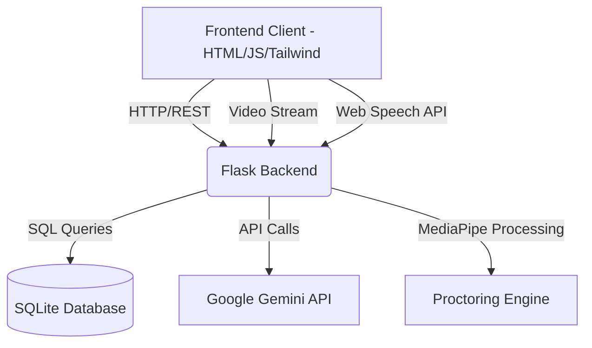
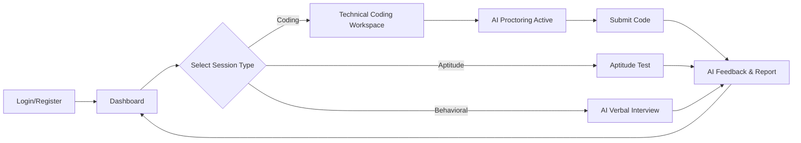
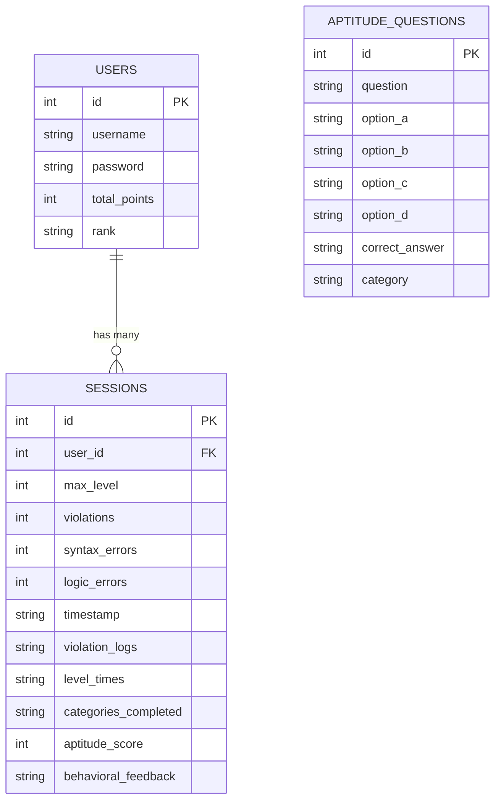

# LockedIn - Presentation Outline

## Slide 1: Title Slide
- **Project Name:** LockedIn (7-Star Editor & AI Interviewer)
- **Subtitle:** An AI-powered proctoring and interview prep platform
- **Team Members:** [Insert Names]
- **Date:** [Insert Date]

## Slide 2: Problem Statement
- Traditional coding platforms lack real-time interview pressure.
- Candidates struggle with behavioral interviews and technical communication.
- Remote assessments suffer from poor proctoring and high cheating rates.

## Slide 3: Introduction
- **What is LockedIn?**
  - A comprehensive AI-driven platform for software engineering interview preparation.
- **Core Value Proposition:**
  - Combines a real-time coding editor with strict AI proctoring.
  - Offers immediate technical and behavioral feedback using Google's Gemini 2.0.

## Slide 4: Tech Stack
- **Frontend:** HTML, TailwindCSS, Monaco Editor, Chart.js
- **Backend:** Python, Flask
- **Database:** SQLite
- **AI & Computer Vision:** OpenCV, MediaPipe (Face Mesh), Google Gemini AI API

## Slide 5: Key Features
- **Real-time AI Proctoring:** Tracks face movement, tab switching, and audio levels.
- **Verbal Behavioral Interviews:** Voice-to-voice interaction with Gemini AI.
- **Skill Analytics Radar:** Visualizes mastery across different CS topics.
- **CS Aptitude Tests:** Quizzes on core computer science concepts.
- **Advanced Code Editor:** Multi-language support (Python, Java, JS) with keystroke dynamic monitoring.

## Slide 6: System Architecture Diagram
- Visualizing Frontend <-> Flask Backend <-> SQLite / Gemini API

## Slide 7: User Flow Diagram
- Login -> Select Mode -> Attempt Challenge -> AI Proctoring -> Final Assessment Report

## Slide 8: Entity-Relationship (ER) Model
- Tables: Users, Sessions, Aptitude_Questions

## Slide 9: Live Demo Highlights
- Discuss or show screenshots of:
  - Violation tracking (Red screen borders for audio/face violations).
  - AI chat window analyzing code.
  - Radar chart showing user skill progression.
  - Verbal interview interface.

## Slide 10: Future Scope & Conclusion
- **Future Enhancements:**
  - Integration with WebRTC for more seamless audio streaming.
  - Expanding language support in the compiler.
  - Multi-user mock interviews.
- **Conclusion:**
  - LockedIn effectively simulates high-pressure interview environments, bridging the gap between learning to code and successfully passing technical interviews.
