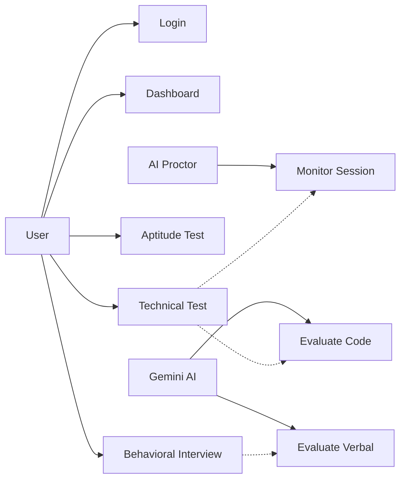
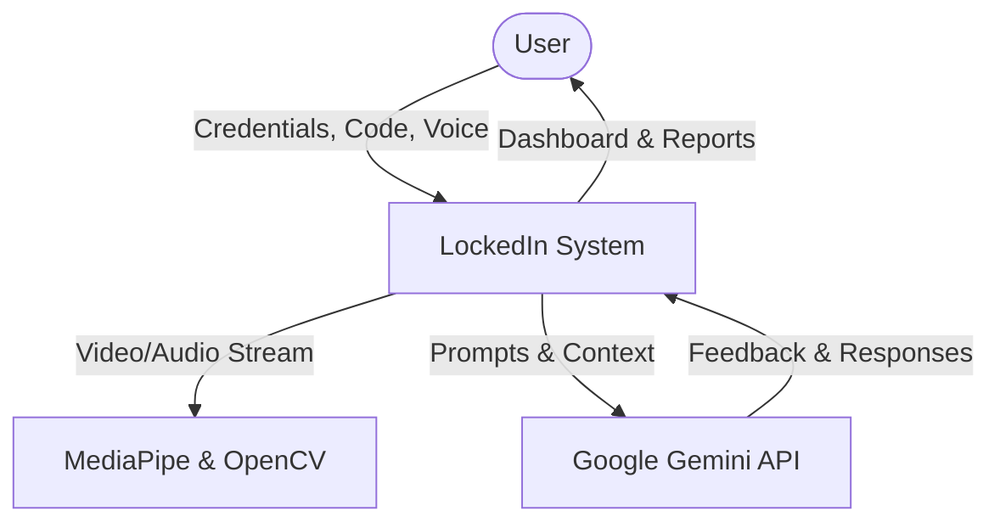
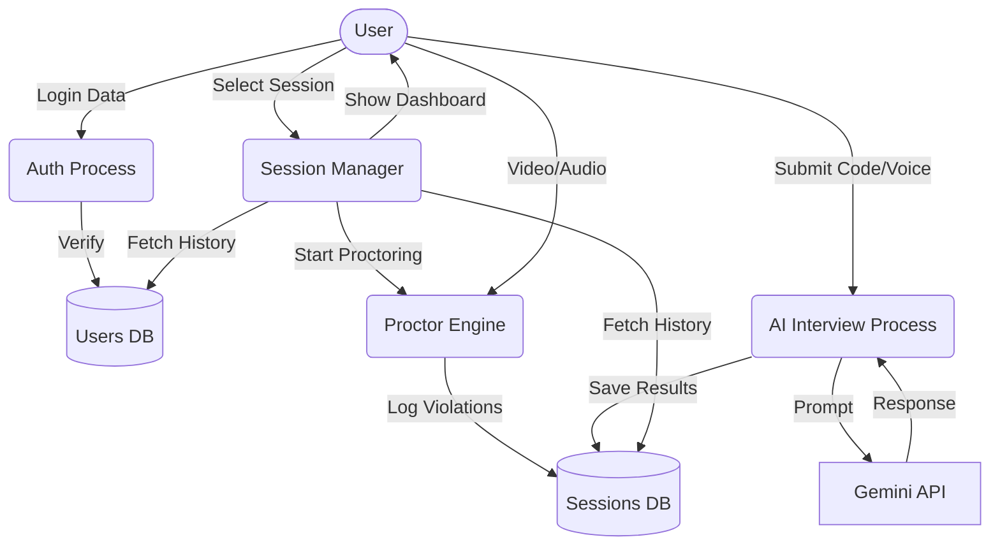
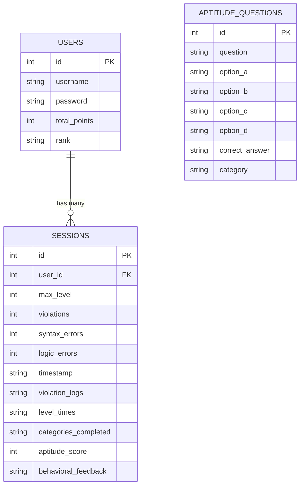
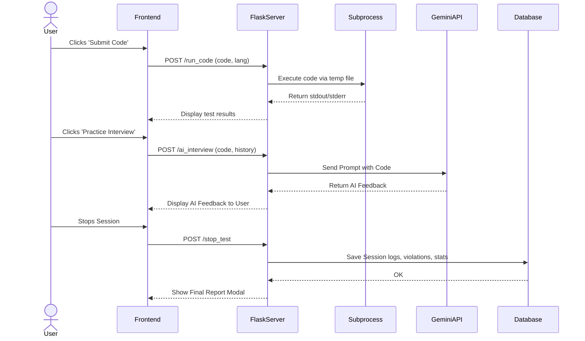

# LockedIn Project Report Structure

## 1. Title Page & Abstract
- **Project Title**
- **Student Details**
- **Abstract:** A brief summary of the LockedIn project, its objectives (improving interview skills via AI proctoring and feedback), the technology stack, and the overall outcome.

## 2. Introduction
- **2.1 Background:** The need for comprehensive interview prep tools.
- **2.2 Objectives:** What LockedIn aims to solve (proctoring, realistic environment, AI feedback).
- **2.3 Scope of the Project:** Supported features (Coding, Aptitude, Behavioral).

## 3. Problem Formulation & Proposed Solution
- **3.1 Current System Drawbacks:** Lack of pressure in LeetCode, lack of proctoring in self-assessments.
- **3.2 Proposed System:** LockedIn as an all-in-one solution with a strict environment.

## 4. System Architecture & Tech Stack Details
- **Frontend:** HTML, TailwindCSS, Monaco Editor (for VS Code-like experience), Chart.js (analytics).
- **Backend:** Flask (Python server), subprocess module for isolated code execution.
- **Database:** SQLite (lightweight, relational data mapping).
- **AI & ML:** MediaPipe (Face Mesh for tracking), OpenCV, Google Gemini 2.0 API (Code analysis and behavioral interview).

## 5. Implementation Details
- **5.1 AI Proctoring Module:**
  - Face tracking (calculating nose and iris ratios using MediaPipe).
  - Audio monitoring (volume thresholding using pyaudio/sounddevice).
  - Tab switching detection via JavaScript Visibility API.
- **5.2 Coding Environment:**
  - Keystroke dynamics and copy-paste detection to prevent cheating.
  - Real-time compilation using Python subprocesses.
- **5.3 AI Interviewer:**
  - Integration with Gemini 2.0 to provide code feedback and act as a voice-based behavioral interviewer.
- **5.4 Analytics Dashboard:**
  - Radar charts summarizing skill proficiency based on completed categories.
  - Detailed session reports with violation history.

## 6. Required Diagrams

### 6.1 Use Case Diagram
```mermaid
usecaseDiagram
    actor User
    actor AI_Proctor
    actor AI_Interviewer
    
    User --> (Register / Login)
    User --> (Take Technical Test)
    User --> (Take Aptitude Test)
    User --> (Take Behavioral Interview)
    User --> (View Dashboard & Analytics)
    
    (Take Technical Test) <.. (Monitor Face & Audio) : <<include>>
    AI_Proctor --> (Monitor Face & Audio)
    
    (Take Behavioral Interview) <.. (Evaluate Responses) : <<include>>
    AI_Interviewer --> (Evaluate Responses)
    (Take Technical Test) <.. (Evaluate Code) : <<include>>
    AI_Interviewer --> (Evaluate Code)
```
*(Note: Mermaid use case syntax is better represented using graph LR or flowchart, but standard UML representations can be drawn from this logic.)*

Alternative Use Case Flowchart:


### 6.2 Data Flow Diagram (Level 0 and Level 1)
**Level 0 (Context Diagram):**


**Level 1 DFD:**


### 6.3 Entity-Relationship (ER) Diagram


### 6.4 Sequence Diagram (Code Submission to AI Evaluation flow)


## 7. Results & Testing
- **Unit Testing:** Validating code execution environment for Python, Java, JS.
- **Proctoring Accuracy:** Precision of face tracking in detecting "looking away" events and capturing audio spikes.
- **Edge Cases Handled:** Syntax vs. Logic errors differentiation, timeout enforcement on infinite loops.

## 8. Conclusion & Future Work
- Summarize the effectiveness of the AI proctor and the value of Gemini feedback.
- Outline next steps (e.g., cloud-based compilation sandbox, multiplayer interviews).

## 9. References
- Flask Documentation
- MediaPipe Face Mesh Research
- Google Gemini API Docs
- Chart.js documentation
